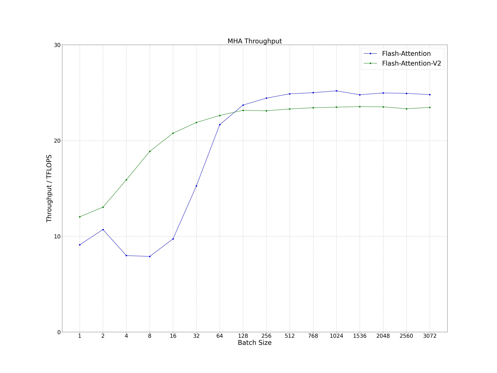
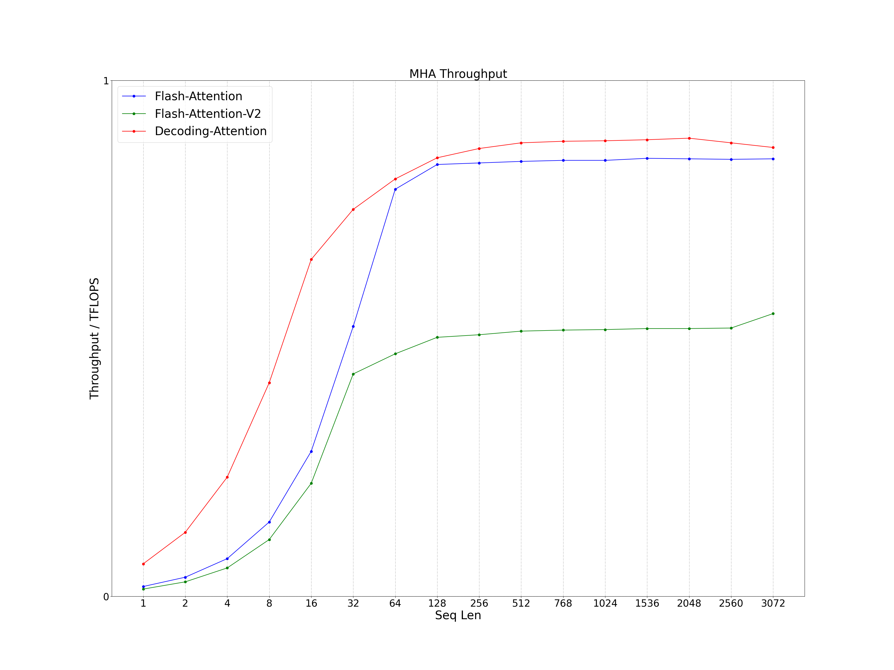
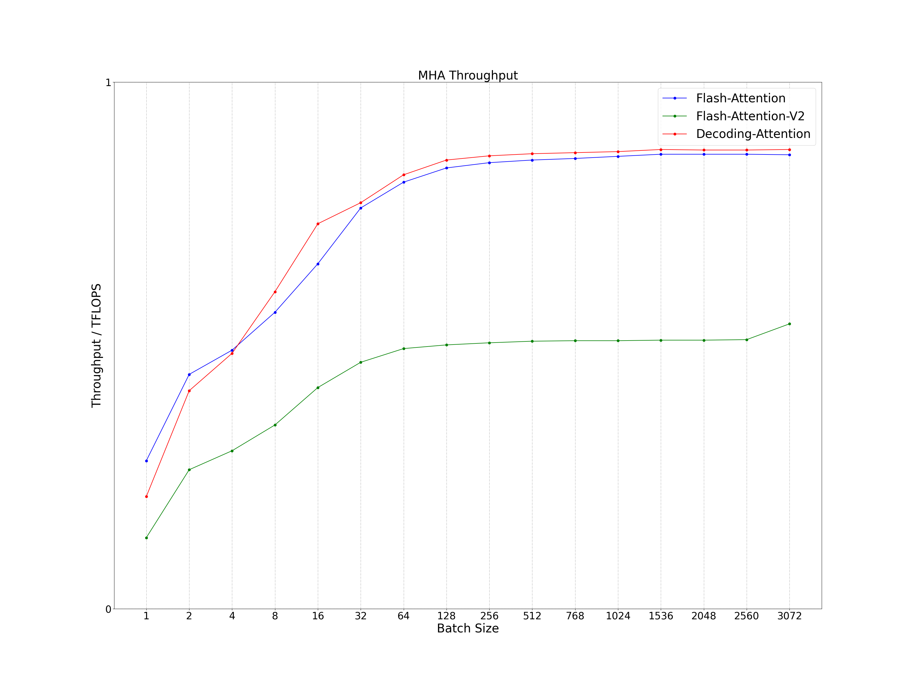
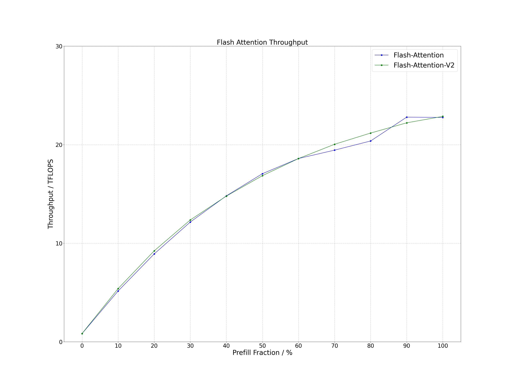

# Flash Attention Inference
## Flash Attention Optimization
Performance of the C++ interface of Flash Attention and Flash Attention v2 in large language model (LLM) inference scenarios. The calculation expression is as follows, where the precision of tensor Q, K, V and O is FP16. Remove redundant code from Flash Attention that has nothing to do with inference, such as backward, dropout, bf16 and torch dependencies, so you can easily integrate this Flash Attention into LLM inference programs. In addition, Flash Attention and Flash Attention v2 have been modified to support group query attention (GQA) / multi query attention (MQA), hybrid by prefill and decoding and attention with linear biases (ALiBi) inference scenarios.
```
O = Softmax(Q * K^T) * V
```


## Decoding attention
Decoding attention is specially optimized for multi head attention (MHA) using CUDA core for the decoding stage of LLM inference. It mainly refers to OpenPPL and Flash Attention, which can solve the problem of low tensor core utilization of Flash Attention in the decoding stage of LLM inference and support more types of attention and quantization optimization. The calculation expression is as follows, where the precision of tensor Q, K, V and O is FP16. In most LLM inference decoding scenarios, the performance of Decoding Attention is better than Flash Attention and Flash Attention v2. In addition, Decoding Attention also supports GQA / MQA and ALiBi inference scenarios.


## Decoding attention Quantization
At the same time, various quantization methods were explored for KV cache in Decoding Attention, which can save nearly half of the GPU memory and reduce the cost of LLM inference. 

### Int8 Quantization
Usually, there are the following 4 types of int8 quantization schemes for KV cache:
- Per Tensor: Uniform quantization of K or V of all tokens
- Per Token: Uniform quantization of K or V of a certain token
- Per Head: Uniform quantization of K or V of a certain head of a certain token
- Per Group: Group quantization of K or V of a certain head of a certain token

The Per Tensor solution has high GPU memory benefits, but the accuracy may drop significantly; the Per Group solution has high accuracy, but the scale storage capacity is large, and the GPU memory benefits are not high. Here, in order to take into account both quantization accuracy and memory gain, Per Head’s quantization scheme was chosen.

### FP8 Quantization
In addition, I also tried to use the quantization method of directly converting KV cache to FP8, including E5M2 and E4M3 formats. I found that the quantization accuracy of FP8 is better than that of int8, and there is no need to store additional scale, which means that the GPU memory benefit of FP8 will be greater big. The quantization and dequantization process of FP8 is also relatively elegant and can be integrated into Decoding Attention.

# Support
- GQA/MQA Inference: Group query attention / multi query attention inference
- Hybrid Inference: Hybrid inference by prefill and decoding
- ALiBi Inference: Attention with linear biases inference
- Decoding Attention: Self MHA of decoding stage with CUDA core
- Decoding Attention Int8: Self MHA of decoding stage with CUDA core, and KV cache is quantized by int8 using per head method
- Decoding Attention FP8E5M2: Self MHA of decoding stage with CUDA core, and KV cache is quantized by FP8 with E5M2
- Decoding Attention FP8E4M3: Self MHA of decoding stage with CUDA core, and KV cache is quantized by FP8 with E4M3

# Compile
## Environment
- OS: Linux
- Cmake Version: >= 3.12
- GCC Version: >= 5
- CUDA Version: >= 11.4 (FP8 requires CUDA version to be at least 11.8)
- Gflags: install on ubuntu as follows
```
sudo apt-get install libgflags-dev
```

## Clone
```
git clone https://github.com/Bruce-Lee-LY/flash_attention_inference.git
```

## Build
### NVIDIA A100
```
cd flash_attention_inference
./build.sh -a 80 -t Release -b OFF
./build.sh -a 80 -t Debug -b OFF
```

### RTX3080Ti / RTX3090 / RTX A6000
```
cd flash_attention_inference
./build.sh -a 86 -t Release -b OFF
./build.sh -a 86 -t Debug -b OFF
```

# Run Sample
```
./run_sample.sh
```

# Performance
Process the data in the log and plot it as a line chart.

```
cd tools/performance
./performance.sh
```

## RTX3090
- CUDA Version: 11.8
- Head Num: 32
- Head Dim: 128

### Prefill
#### Seq Len
The performance of both is similar for short sequences and Flash Attention v2 performs well in long sequences. It can increase by about 50%.
- Batch Size: 128
- Seq Q: Seq Len
- Seq K: Seq Len


#### Batch Size
When the batch size is small, the Flash Attention v2 performance is better. When the batch size is large, the performance of the two kernels is comparable.
- Batch Size: Batch Size
- Seq Q: 128
- Seq K: 128



### Decoding
#### Seq Len
The performance of both is similar for short sequences and Flash Attention performs well in long sequences. Regardless of the size of seq len, Decoding Attention performance is better than Flash Attention and Flash Attention v2.
- Batch Size: 128
- Seq Q: 1
- Seq K: Seq Len



#### Batch Size
The Flash Attention performance is better regardless of batch size. When the batch size is less than 4, the Decoding Attention performance is between Flash Attention and Flash Attention v2, when the batch size is greater than 4, the Decoding Attention performance is better than Flash Attention and Flash Attention v2.
- Batch Size: Batch Size
- Seq Q: 1
- Seq K: 128



### Hybrid
Regardless of the ratio of Prefill to Decoding, Flash Attention and Flash Attention v2 are similar in performance.
- Batch Size: 100
- Seq Q: 128
- Seq K: 128



# Reference
## [flash-attention](https://github.com/Dao-AILab/flash-attention)
- Flash Attention: v1.0.9
- Flash Attention v2: v2.1.0

## [cutlass](https://github.com/NVIDIA/cutlass)
- cutlass: v3.1.0
